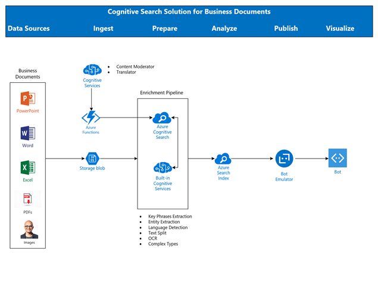
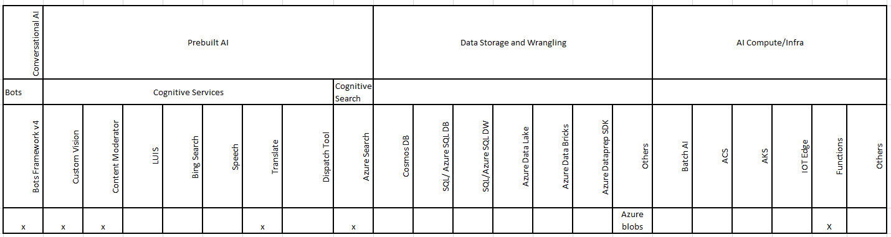

# Enterprise Knowledge Mining Solution using the Microsoft AI Platform
### Build an enterprise scale intelligent search solution for searching business documents using Microsoft Azure and Cognitive Search

#### About this Course
In this course, you will learn to build an enterprise search solution by applying knowledge mining approach to search an organization’s business documents like Microsoft Office, PDFs and images using Azure search and Cognitive search skillsets and expose the results via a Bot interface.

You will learn to perform entity recognition, image analysis, text translation and indexed search on enterprise business documents using Microsoft Cognitive Services and Azure Search. This approach can be used with almost any Azure service to augment a customer’s scenario involving intelligent search. 

While this course focusses on Azure and Cognitive search capabilities, a depth course on building Bots and integrating various cognitive services is available here - [Building Intelligent Agents and Apps](https://azure.github.io/LearnAI-Bootcamp/emergingaidev_bootcamp).

In this course you will learn

-- Fundamentals of Azure Search and its capabilities.

-- Understand Microsoft Cognitive Search and its key scenarios for using them.

-- Build an enriched data pipeline for search using predefined and custom skillsets:

    -- Text skills like entity recognition, language detection, text manipulation and key phrase extraction.
    
    -- Image skills like OCR.
    
    -- Language skills like text translation.
    
    -- Content moderation skills to block documents with incompliant content.
    
-- Use the enriched data pipeline for a knowledge mining solution on business documents within an enterprise.

-- Expose the knowledge mining solution using a bot interface for document search and consumption.

#### Architecture

#### Technologies Covered

#### Industry application

Intelligent search is relevant to many major industries. Some are listed below.

1.	Retail and health care industries employ chatbots with advanced multi-language support capabilities to service their customers.

2.	Retail, Housing and Automotive industries for sales/listing.

3.	Entertainment industry uses search for relevant/contextual on-demand streaming.

#### Pre-requisites

1.	Fundamental working knowledge of Azure Portal, Functions and Azure Search.

2.	Familiarity with Visual Studio.

3.	Familiarity with Azure Bots and Microsoft Bot Framework v4.

If you do not have any familiarity with the above pre-requisites, please find below links
1. *To Read (10 minutes):* [Visual Studio Tutorial](https://docs.microsoft.com/en-us/visualstudio/ide/visual-studio-ide)
1. *To Read (4 minutes):* [Azure Functions Overview](https://docs.microsoft.com/en-us/azure/azure-functions/functions-overview)  
1. *To Read (10 minutes):* [Azure Search Overview](https://docs.microsoft.com/en-us/azure/search/search-what-is-azure-search) 
1. *To Read (7 minutes):* [Postman Tutorial](https://docs.microsoft.com/en-us/azure/search/search-fiddler) 
1. *To Do (30 minutes):* [C# Quickstart](https://docs.microsoft.com/en-us/dotnet/csharp/quick-starts/) 

#### Pre-Setup before you attend the class Mandatory
1. *To Create:* You need a Microsoft Azure account to create the services we use in our solution. You can create a [free account](https://azure.microsoft.com/en-us/free/), use your [MSDN account](https://azure.microsoft.com/en-us/pricing/member-offers/credit-for-visual-studio-subscribers/) or use any other subscription where you have permission to create services.
1. *To Install:* [Visual Studio 2017](https://www.visualstudio.com/vs/) version version 15.5 or later, *including the Azure development workload*.
1. *To Install:* [Postman](https://www.getpostman.com/). To call the labs APIs.

#### Course Details

Primary Audience: Azure AI Developers, Architects.
Secondary Audience:  Any professional interested in learning AI.

#### Level

This content is designed as an intermediate to advanced level course for AI developers and/or architects.

#### Type
This course, in its full form, is designed to be taught in-person but you can also use the materials in a self-paced fashion. There are assignments and multiple reference links throughout the materials that support the concepts and skills you will learn.

#### Length

Full Course classroom training:  16 hours

#### Related LearnAI Courses

Building and Implementing Intelligent Agents and Apps

#### Course Modules

1.	Introduction – Overview of Azure Search, Cognitive Search, Scenarios and industry specific applications.

2.	Fundamentals of Azure Search.

3.	Architecture – Solution Architecture for building enterprise search solution.

4.	Cognitive Search Skillset – Applying text skills.

5.	Cognitive Search Skillset – Applying image skills.

6.	Cognitive Search Skillset – Applying Language skills.

7.	Cognitive Search Skillset – Applying Moderation skills.

8.	Build and Integrate a Bot with Cognitive Search API.

9.	Group Hands-on Lab to practice skills acquired.

