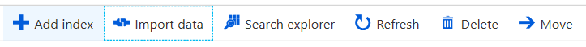
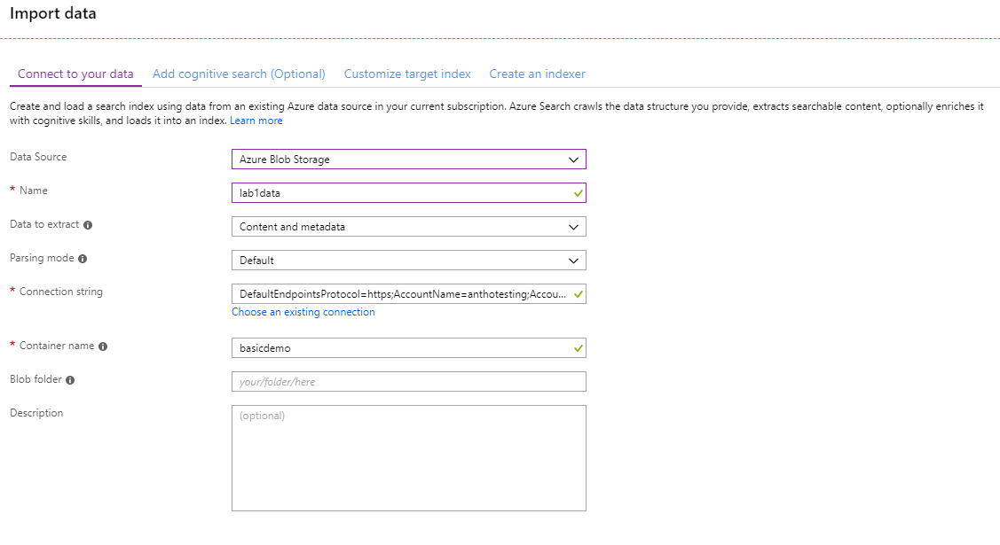
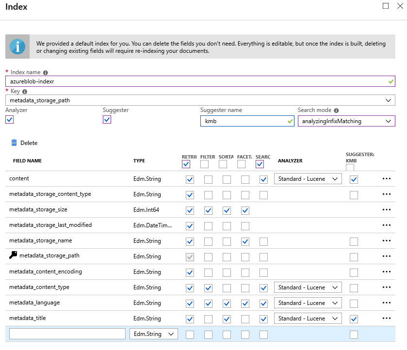
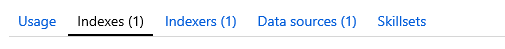
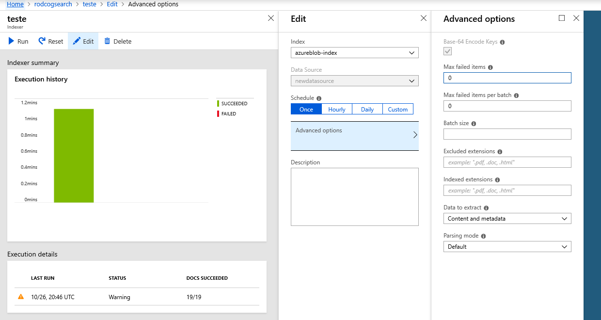
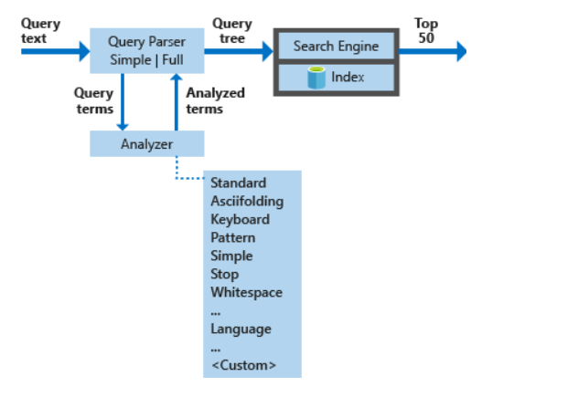
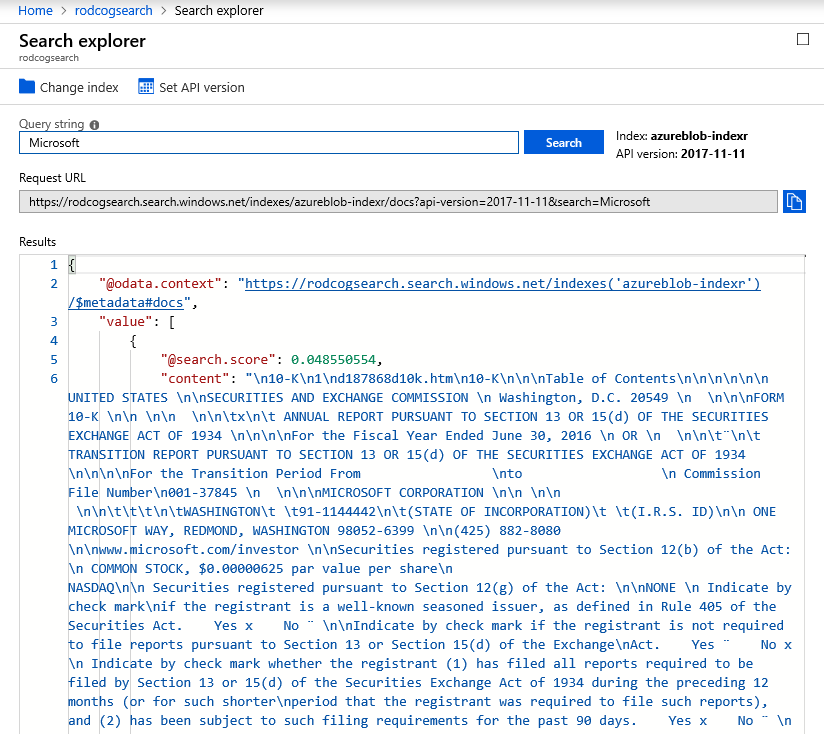

# Azure Search Fundamentals

In this lab, you will learn the basics of the Azure Search service and how to ingest and index a provided dataset using the built-in tools. This lab will teach you how to use the **Azure Portal** to ingest and search the business documents of a provided dataset.

## What is Azure Search

[Azure Search](https://docs.microsoft.com/en-us/azure/search/search-what-is-azure-search) is a search-as-a-service solution allowing developers to incorporate great search experiences into applications without managing infrastructure or needing to become search experts.

Developers look for PaaS services in Azure to achieve better and faster results in their apps. While search is a key to many types of applications, web search engines have set the bar high for search. Users expect: instant results, auto-complete as they type, highlighting hits within the results, great ranking, and the ability to understand what they are looking for, even if they spell it incorrectly or include extra words.

Search is a hard and rarely a core expertise area. From an infrastructure standpoint, it needs to have high availability, durability, scale, and operations. From a functionality standpoint, it needs to have ranking, language support, and geospatial capabilities.

The example above illustrates some of the components users are expecting in their search experience. [Azure Search](https://docs.microsoft.com/en-us/azure/search/search-what-is-azure-search) can accomplish these user experience features, along with giving you [monitoring and reporting](https://docs.microsoft.com/en-us/azure/search/search-traffic-analytics), [simple scoring](https://docs.microsoft.com/en-us/rest/api/searchservice/add-scoring-profiles-to-a-search-index), and tools for [prototyping](https://docs.microsoft.com/en-us/azure/search/search-import-data-portal) and [inspection](https://docs.microsoft.com/en-us/azure/search/search-explorer).

## Typical Workflow

1. Provision service
    - You can create or provision an Azure Search service from the [portal](https://docs.microsoft.com/en-us/azure/search/search-create-service-portal) or with [PowerShell](https://docs.microsoft.com/en-us/azure/search/search-manage-powershell).
1. Create an index
    - An [index](https://docs.microsoft.com/en-us/azure/search/search-what-is-an-index) is a container for data, think "table". It has schema, [CORS options](https://docs.microsoft.com/en-us/aspnet/core/security/cors), search options. You can create it in the [portal](https://docs.microsoft.com/en-us/azure/search/search-create-index-portal) or during [app initialization](https://docs.microsoft.com/en-us/azure/search/search-create-index-dotnet).
1. Index your data
    - There are two ways to [populate an index with your data](https://docs.microsoft.com/en-us/azure/search/search-what-is-data-import). The first option is to manually push your data into the index using the Azure Search [REST API](https://docs.microsoft.com/en-us/azure/search/search-import-data-rest-api) or [.NET SDK](https://docs.microsoft.com/en-us/azure/search/search-import-data-dotnet). The second option is to point a [supported data source](https://docs.microsoft.com/en-us/azure/search/search-import-data-portal) to your index and let Azure Search automatically pull in the data on a schedule.
1. Search an index
    - When submitting search requests to Azure Search, you can use simple search options, you can [filter](https://docs.microsoft.com/en-us/azure/search/search-filters), [sort](https://docs.microsoft.com/en-us/rest/api/searchservice/add-scoring-profiles-to-a-search-index), [project](https://docs.microsoft.com/en-us/azure/search/search-faceted-navigation), and [page over results](https://docs.microsoft.com/en-us/azure/search/search-pagination-page-layout). You have the ability to address spelling mistakes, phonetics, and Regex, and there are options for working with search and [suggest](https://docs.microsoft.com/en-us/rest/api/searchservice/suggesters). These query parameters allow you to achieve deeper control of the [full-text search experience](https://docs.microsoft.com/en-us/azure/search/search-query-overview).

## Lab Steps

### Step 1 - Import Data

Using the Azure Search service created in the previous lab, you will use the "Import Data" wizard, that helps you with all required steps to ingest and analyze your data: data source and index creation.

- From the Overview tab, click on the **Import Data** option and right after, click on **Connect to Data Source**

- Choose the **Azure Blob Storage** Data Source and name it as `lab1data`. Choose the **Content and Metadata** option, we want to index not only the files properties but also their content. Choose the **Default** parsing mode, since the dataset also have pdfs. The **Text** option has performance advantage, but that's not what we want because on the characteristics of our dataset. In the **Connection string** add the connection string collected in the previous lab. In the **Container name**, type "basicdemo". You skip Blob Folder and Description. After you click the **OK** blue button, you will wait a few seconds because Azure Search will be detecting (sampling) the schema and the metadata of the dataset.

- **Don't add anything for Cognitive Search for now**, we will do it in the next lab, using Postman and Azure Search APIs. Just click the blue **Next: Customize target index** button.

- In the index tab, we will define the index structure and features as follows:
  - **Name your index as you want**, but we will use this information later so you should use an easy to type name.

  - **Keep `metada_storage_path` as the key.** This is a unique identifier for each file of the data source. It is a good idea to use the physical path of file, since it is unique by design. Since our dataset is on blob storage, the content of this field is the file URL, that's why it is unique by design. If you check the other options, you will see that metadata_storage_path is only one field that can guarantee uniqueness.

  - **Set all fields to be Retrievable**. This allows the application to retrieve these fields when searched. Please notice they are all strings and among them we have interesting things like metadata_storage_size, metadata_content type, metadata_language, and **the content itself**.

  - Set **metadata_storage_size**, **metadata_content_type**, **metadata_language**, and **metadata_title** as **Filterable**, so you can filter on these fields.

  - Set **metadata_storage_size**, **metadata_language**, and **metadata_title** as **Sortable**. It doesn't make sense to sort for the content since it is a free text.

  - Set **metadata_storage_size**, **metadata_storage_name**, **metadata_language**, and **metadata_title** as **Facetable**, so you can use this categorization for fast searching.

  - Set **content**, **metadata_content_type**, **metadata_language** and **metadata_title** as **Searchable**, you want to be able to search on all of them.

  - Mark the **Analyzer** checkbox and all the fields from the last step will be set to **"Standard - Lucene"**. Navigate through the other language options, to see what is available. The Analyzer takes the terms a user enters and works to find the best matching terms in the Index. Azure Search includes analyzers that are used in technologies like Bing and Office that have deep understanding of 56 languages.

  - Click the **Suggester** checkbox and enter any Suggester name you like. Set the **Search Mode** to **"analyzingInfixMatching"** and choose **content** and **metadata_title** to be the fields to look for term suggestions. The Suggester feature helps the user of terms, as you can see in web search engines.
- If your configuration looks like the image below, click the blue **Next: Create an indexer** button. A validation will be made.

>Note! Using the portal you can't map the source fields more than once (i.e. to change you have to start over). In the next labs, you will create the index and the indexer using API calls, and that **does** allow you to do it. It is also important to realize that you only have the file's metadata to work with. In the next labs you will use Cognitive Search to create metadata from your data, and, as a result, your index will be completely different.

- **Name** your indexer as you want,  keep the schedule as **once**. The indexer is the job that connects the data source, the index and the schedule

- Click the blue **Submit** button, and you will be redirected to the overview tab, where now you can see 1 index, 1 indexer and 1 data source (you may have to refresh your page).

### Step 2 - Check Indexer Execution Status

1. To monitor data import, click on the **Indexers** link (it is in the middle of the page and you can also see it in the middle of the image above).

1. You should see the newly created indexer in the list, with status indicating "Failed" or "Warning". If not, click the refresh button in the top-middle of the overview tab. You should see the newly created indexer in the list, with status indicating "in progress" or "Warning", along with the number of documents indexed, "20/20" is expected.

1. Click on the refresh button, top middle of the page, until the execution is over. The "Warning" status is expected, click on the Indexer name to see the summary. In this page you will see all of the executions this Indexer may have and its details, duration and so on.

1. Click on the "Execution Details" to see the warning messages, you should find problems related to data truncation and unsupported content type. The first message is caused by long texts and the second is very clear on what is going on. Both problems will be addressed in the Cognitive Search labs, helping you to understand the value of this capability.

1. Let's check what else you can do in the Indexer page. Click on the "Edit" link. As you can see, also in the image below, there are some interesting options here.

    - You can change the target Index
    - You can schedule your Indexer again
    - You can check "Advanced Options". Click this option to see:
        - Base-64 Encode Keys. This is the algorithm used encrypt the data of your index key. It is the default option of the Index creation and this encryption avoids a typical problem of the metadata_storage_path, our recommended field for the documents key, as mentioned in the previous step. The storage path will have characters like "/" that are not allowed in a key. That's a **paradox**, we "have to use" metadata_storage_path but typically it has invalid characters. The Base-64 encryption fixes this problem. It also means that the data within the Azure Search Index is protected and your app needs to decrypt it to read in "human format".
        - You will also see options for max errors per execution, items per execution, execution size and so on.
        - Note that you can change the "Data to extract" and the "Parsing mode" options.

    

### Step 3 - Query the Azure Search Index

Azure Search implements two Lucene-based query languages: [Simple Query Parser](https://lucene.apache.org/core/4_7_0/queryparser/org/apache/lucene/queryparser/simple/SimpleQueryParser.html) and the [Lucene Query Parser](https://lucene.apache.org/core/4_10_2/queryparser/org/apache/lucene/queryparser/classic/package-summary.html). In Azure Search, the simple query syntax excludes the fuzzy/slop options.

The image below explains how Azure Search executes a query. The process has four stages:

1. Query parsing
1. Lexical analysis
1. Document retrieval
1. Scoring

At this point of the lab, we can try searching the index. Let's keep on using the Azure Portal for this.

1. Navigate back to the **Overview Tab** and click the **Indexes** link, the second from the left to the right. You should see the "Document Count" and the Storage Size. The expected count is 20 and the size should be close to 2.19 MiB. As you can see, Azure Search doesn't store all of the document, just part of it: key words, metadata, tags.

1. Click **Search Explorer** and in the Overview Tab select your Index in the **"Change Index"** button.

1. Click **Search** to search for all documents. You can use any valid simple or full Lucene query syntax to create the request. The * character is equivalent to an empty or unspecified search that returns all documents in no particular order. You should see information returned for all of the 20 documents.

1. Try searching for "Microsoft", a different result set is expected. In the resulting json, you'll see a number after `@search.score`. Scoring refers to the computation of a search score for every item returned in search results. The score is an indicator of an item's relevance in the context of the current search operation. The higher the score, the more relevant the item. In search results, items are rank ordered from high to low, based on the search scores calculated for each item.

1. You will probably see results like the image below. Scroll down until you see all meta information available.

## Challenge

Using [Azure Search Simple Query Syntax](https://docs.microsoft.com/en-us/rest/api/searchservice/simple-query-syntax-in-azure-search), try to create queries for the following situations:

1. Return only the first document
1. Search documents where words "Microsoft" and "Cloud" are up to 20 words distant one from the other
1. Search for documents about Cloud, ordering the results by the score
1. Search for documents about Cloud, but filtering those with mentions to Oracle
1. Search for documents about Cognitive Services and Bots

## Finished Solution

If you could not make it, [here](../resources/finished-solutions/finished-solution-lab-azure-search.md) is the challenge solution. You just need to follow the steps.

## Extra Content

The links below will work only with the API, which you will learn in the next labs. While you will not use it in these labs, check them now to learn more about other Azure Search capabilities.

[Azure Search's `moreLikeThis`](https://docs.microsoft.com/en-us/azure/search/search-more-like-this) feature is a feature to find documents that are similar to the document specified by the document key.

[Synonyms](https://docs.microsoft.com/en-us/azure/search/search-synonyms) is a feature that allows you to search on previously mapped terms. Example: If you map MSFT as Microsoft, both searches will have the same results.

[Lucene Query Syntax](https://docs.microsoft.com/en-us/azure/search/search-query-lucene-examples) is also supported, giving you more flexibility to meet your business requirements.

## Next Step

[Text Skills Lab](../labs/lab-text-skills.md) or
[Back to Read Me](../README.md)