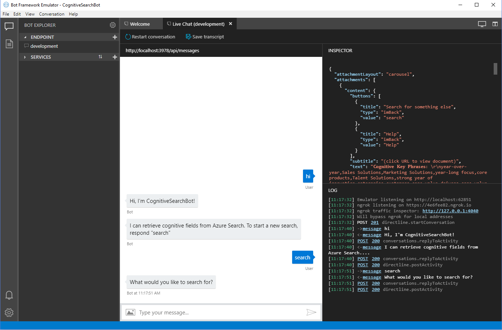
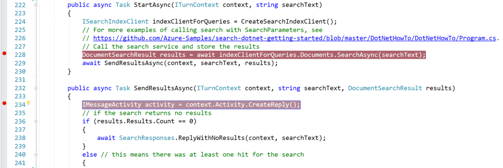
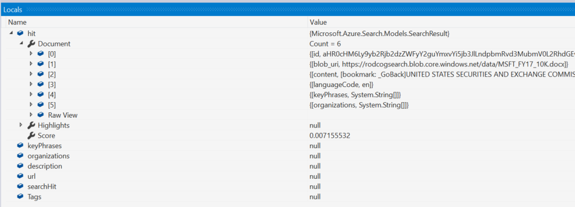
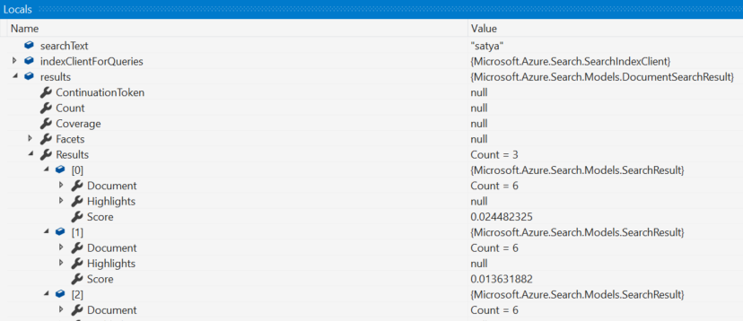

# Lab 4: Creating the Business Documents Bot

In this lab, you will learn how Azure Cognitive Search can be integrated into a bot using the Microsoft Bot Framework (SDK V4, .NET Core). Since this is not a bot course, the creation has been taken care of for you. However, you'll get the chance to interact with your search service via the bot and use debugging to follow the processes to call the Azure Cognitive Search API and format results. If you're interested in diving deeper into bot development, check out the [LearnAI: Azure Cognitive Services Bootcamp](https://azure.github.io/LearnAI-Bootcamp/emergingaidev_bootcamp) which integrates multiple Cognitive Services to create an intelligent agent.

> While this is a simple bot, this [gif](../resources/images/lab-bot/retrieving-cognitive-attrributes.gif) provides some inspiration for what a solution could look like in a real estate scenario. Hopefully, it gives you some inspiration for what's possible. You could also integrate this into a web app, here is a [WebMD example](http://webmedsearch.azurewebsites.net/) and a [Seismic data example](http://seismicsearch.azurewebsites.net/).

## Step 1 - Download and install the Bot Framework Emulator

The Bot Framework Emulator helps you run your bots locally for testing and debugging purposes. Download the emulator by going to [this page](https://github.com/Microsoft/BotFramework-Emulator/releases) and downloading the most recent version of the emulator that has the tag "Latest Release" (select the ".exe" file, if you are using windows).
> The instructions for the rest of the labs will assume you've downloaded the V4 Emulator (as opposed to the V3 Emulator).

The emulator installs to `c:\Users\`_your-username_`\AppData\Local\botframework\app-`_version_`\botframework-emulator.exe` or to your Downloads folder, depending on browser. Run the install and open the emulator, you'll use it shortly.

## Step 2 - Accessing the sample

As part of the environment creation lab, you should have cloned the repository to your local environment. If you have not, now is a good time to go back and do so.  

Under **resources > bot-code**, you should be able to locate a "Microsoft Visual Studio Solution File" called "CognitiveSearchBot". Double-click on it to open the solution.  

Once the solution is open, right-click on "Solution 'CognitiveSearchBot'" in the Solution Explorer (from now on we'll just refer to this as "the solution") and select "Rebuild" to pull down all the dependencies required.  

> Note: There is a lot of "stuff" in this solution. If you've worked with bots before, you may be interested in looking around to see how we've set up the state, regular expressions, and the dialogs/responses. If you've never worked with bots before, do not fret! This is not a bots course, so we'll walk you through the important things we want you to learn.  

Right-click on the solution and select "Manage NuGet Packages for Solution...". Under "Installed", you should find "Microsoft.Azure.Search" listed. There's no action here, but you should know that this package contains libraries that make it very easy for us to call the Azure Cognitive Search API and process the results.  

Open "CognitiveSearchBot.cs" by double-clicking on it in the Solution Explorer. While there are lots of files in this solution, this is the most relevant one to integrating your search service. Spend at least five minutes reading the file **from start to finish**. We've commented what's happening on almost every line, so it is hopefully easy to follow, even if you don't have a background with bots.  

Near the bottom of the class, within `CreateSearchIndexClient()`, you'll notice that you need to fill in your search service name, search service key, and index name. Since you've created and tested the index in Postman, you should have these readily available. If not, you can open the Azure portal and locate your Azure Search service to get the needed information. Fill in your information and save the file (you can use `CTRL` + `S`).

## Step 3 - Interacting with your Cognitive Search Bot

In Visual Studio, select the green button (looks like a play button) in the top menu bar to run the bot (you can alternatively select `F5` on your keyboard). This will build and run the bot locally, opening a few pages for testing purposes. The pages will close if you stop running the bot.  

Open the Bot Emulator if it is not open already. Select the button "Open Bot" from the Welcome page. Navigate to where your "BotConfiguration.bot" file is located (should be under **resources > bot-code** if you followed the previous instructions).  

This should open a chat window with your bot. You can start by saying some sort of greeting ("hi", "hello", "whats up bot", etc.). The bot should respond with a greeting, followed by the help message that says what it can do. Since really all it can do is search, enter "search" to trigger the search dialog.

You should now be able to submit search requests, and your results should be returned. Try searching for various items and inspecting your results. If you're unsure what to search for, here are a few suggestions: "satya nadella", "financial reporting", "security issues", "Azure", "cognitive services", "cloud", "sql server", "learnai", "reports".

## Step 4 (optional) - Using break points to understand the search flow

If you want to dive slightly deeper into calling the Azure Cognitive Search API and processing the results, we have provided some guidance on how to do so with break points.  

First, stop your bot (by hitting the stop button in Visual Studio).  

Open the "CognitiveSearchBot.cs" file. First, note that on lines 13 and 14, you are referencing the Azure Search NuGet package that was installed. Remember, this is crucial to running the commands you are about to step through.  

Next, scroll down to where the search related tasks are located. Place a break point on lines 228 and 234 (on the lines `DocumentSearchResult results = await indexClientForQueries.Documents.SearchAsync(searchText);` and `IMessageActivity activity = context.Activity.CreateReply();`) by clicking in the grey area left of the numbers. You should see a red dot next to the break point lines, as shown below:  

Next, run the bot (select `F5`) and (after sending "hi" then "search") search for something. Visual Studio will likely start blinking requesting your return. In Visual Studio, you should see the line about to be executed highlighted. Select `F11` repeatedly to step through what is happening as the search is processed. In the bottom box within Visual Studio, you should see "Locals". These values can be expanded and inspected. For example, when you see "hit" in "Locals", you can expand it to see the results from the API call for a single search hit.

Similarly, when "results" has been filled, you can see how many "hits" there are and expand those details as well.

Using break points for debugging and seeing how calls are made and processed is a very valuable tool. If you'd like to learn more, [start here](https://docs.microsoft.com/en-us/visualstudio/debugger/getting-started-with-the-debugger?view=vs-2017).  

> Want to dive deeper into bot development? Check out the [LearnAI: Azure Cognitive Services Bootcamp](https://azure.github.io/LearnAI-Bootcamp/emergingaidev_bootcamp) which integrates multiple Cognitive Services to create an intelligent agent.

## Cleaning your environment

You have completed all of the hands-on portions of the course. We recommend deleting the resource group (and all of the resources in it) to avoid incurring extra charges.

## Next Step

[Final Case](../labs/lab-final-case.md) or
[Back to Read Me](../README.md)