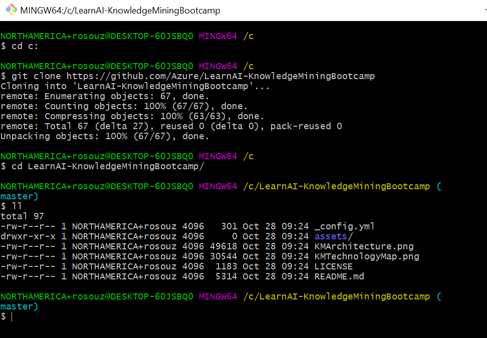

# Environment Creation

In this lab, you will create an Azure Search service and a storage account. We recommend keeping both in a new and unique resource group, to make it easier to delete at the end of the workshop (if you want to). We will also upload the data to a blob storage within the storage account.

## Step 1 - Create the Azure Search service

1. Go to the [Azure portal](https://portal.azure.com) and sign in with your Azure account.

1. Click **Create a resource**, search for Azure Search, and click **Create**. See [Create an Azure Search service in the portal](https://docs.microsoft.com/en-us/azure/search/search-create-service-portal) if you are setting up a search service for the first time, and use the bullet point list below for the details you will use to fill out the details for the Azure Search service.

  

1. For the **URL**, that is the service name, choose a name that you can easily remember. We will use it dozens of times in the next labs. The name of the service in the screenshots of this lab won't be available, you must create your own service name.

1. For **Resource group**, create a resource group to contain all the resources you create in this tutorial. This makes it easier to clean up the resources after you have finished the tutorial.

1. For **Location**, choose either **South Central US** or **West Europe**. Currently, the Cognitive Search API is only available in these two regions

1. For **Pricing tier**, you can create a **Free** service to complete tutorials and quickstarts. For deeper investigation using your own data, create a [paid service](https://azure.microsoft.com/pricing/details/search/) such as **Basic** or **Standard**. For these labs, we recommend using the **Basic** tier.

  A Free service is limited to 3 indexes, 16 MB maximum blob size, and 2 minutes of indexing, which is often insufficient for exercising the full capabilities of cognitive search. To review limits for different tiers, see [Service Limits](https://docs.microsoft.com/en-us/azure/search/search-limits-quotas-capacity).

  > Tip! Cognitive Search is in public preview. Skillset execution is currently available in all tiers, including free. At a later time, the pricing for this capability will be announced.

1. Pin the service to the dashboard for fast access to service information.

  

1. After the service is created, collect the following information: **URL** from the Overview page, and **api-key** (either primary or secondary) from the Keys page. You will need them in the following labs.

  

>Note!
> Azure Search must have 2 replicas for read-only SLA and 3 replicas for read/write SLA. This is not addressed in this training. For more information, click [here](https://azure.microsoft.com/en-us/support/legal/sla/search/v1_0/)

## Step 2 - Clone the Repo

Cloning the repo will download all the training materials to your computer, including the dataset, the slides and the code for the Bot project.

1. In the Cortana search bar, type "git bash" and select "Git Bash Desktop App", or type "cmd" and select "Command Prompt".

1. Next, type `cd c:` then enter. Now, you will be in the root directory of your computer. If you don't have permission to create folders and files here, navigate to a folder where you can download the Bootcamp materials.

1. Type and enter `git clone https://github.com/Azure/LearnAI-KnowledgeMiningBootcamp.git`

1. *Validation step*: Go to **C:\LearnAI-KnowledgeMiningBootcamp** and confirm it exists, including the dataset in the resources folder



>Note! The image above has a smaller number of files downloaded than expected, the training is under constant development.

## Step 3 - Create the Azure Blob service and upload the dataset

The enrichment pipeline pulls from Azure data sources. Source data must originate from a supported data source type of an [Azure Search indexer](https://docs.microsoft.com/en-us/azure/search/search-indexer-overview). For this exercise, we use blob storage to showcase multiple content types.

 1. Create a **storage account** in the **same region of your Azure Search service** created in the step above, to avoid latency between the search service and the files.  Use a **general purpose** account and **LRS replication**. For production environments, you may need to use another replication type. If you haven't done this before, you can refer to the [Azure Storage Explorer Quickstart](https://docs.microsoft.com/en-us/azure/vs-azure-tools-storage-manage-with-storage-explorer?tabs=windows) for instructions on all the steps.

 1. Within this storage account, create a **container** named **`basicdemo`**.

 1. You can upload the sample files from the **\resources\dataset** folder to the blob storage using [Azure Portal](https://docs.microsoft.com/en-us/azure/storage/blobs/storage-quickstart-blobs-portal) or [Azure Storage Explorer](https://docs.microsoft.com/en-us/azure/storage/blobs/storage-quickstart-blobs-storage-explorer). There are other methods to upload data to Azure, but we don't  suggest them for this training.

>Tip! If you are using Azure Storage Explorer, in the `basicdemo` container you created, click **Upload** to upload the sample files.

 After sample files are uploaded, get the container name and a connection string for your Blob storage. You could do that by navigating to your storage account in the Azure portal. On **Access keys**, and then copy the **Connection String**  field.

 We recommend storing the container name and connection string with your Azure Search URL and api-key from Step 1. The connection string should be a URL similar to the following hypothetical example:

  ```http
  DefaultEndpointsProtocol=https;AccountName=cogsrchdemostorage;AccountKey=<your key here>==;EndpointSuffix=core.windows.net
  ```

There are other ways to specify the connection string, such as providing a shared access signature. We won't be covering that in this workshop, but to learn more about data source credentials, see [Indexing Azure Blob Storage](https://docs.microsoft.com/en-us/azure/search/search-howto-indexing-azure-blob-storage).

## Next Step

[Azure Search Lab](../labs/lab-azure-search.md) or
[Back to Read Me](../README.md)