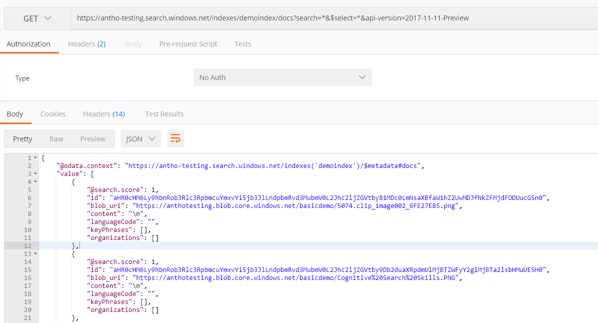

# Lab 2: Create a Cognitive Search Skillset with **Image** Skills

In this lab, we will verify the lack of image processing results we got from the previous lab and fix it by adding image analysis skill set to our pipeline.

## Part I: The Problem Statement

There are png and jpg images within the provided dataset. If you decided to bring your own data, it was suggested to also include images. But we did not add any predefined skillsets for image analysis. This is exactly what we will do now, but first, let's check out the kind of problems we could expect to see if we used the Language Detection, Text Split, Named Entity Recognition and Key Phrase Extraction Skills on images with steps 1 and 2.

### Step 1 - Checking warning message from the API

Let's check the indexer status again, it has valuable information about our "images problem". You can use the same command we used in the previous lab (pasted below for convenience). If you used another indexer name, just change it in the URL.

```http
GET https://[servicename].search.windows.net/indexers/demoindexer/status?api-version=2017-11-11-Preview
Content-Type: application/json
api-key: [api-key]
```

If you check the response messages for any of the png or jpg files in the results, there will be warnings and no metadata for the images.

### Step 2 - Existing skills will show no results

Let's again repeat a previous lab request, but with another analysis. We will re-execute the step to verify content, but this time querying all fields.  

```http
GET https://[servicename].search.windows.net/indexes/demoindex/docs?search=*&$select=languageCode,keyPhrases,blob_uri&api-version=2017-11-11-Preview
Content-Type: application/json
api-key: [api-key]
```

Send the request. The web test tool should return the results in the textbox at the bottom of the Postman application.

Go to line 106, you should see the following value in this line

>"blob_uri": "<https://ctosa[your-container].blob.core.windows.net/basicdemo/redshirt.jpg">

Note that no data values are returned on lines 107 - 110 for the key values that are defined as these return results back for the Language Detection, Text Split, Named Entity Recognition and Key Phrase Extraction Skills, which we defined in the previous lab. As the object in line 106 is just an image, we need to have a skills that deals with that.

>Tip: if the value described does not appear on line 106, in the top right of the results screen is a magnifying glass button. Click on this button to open the Search box, in the text box type **"redshirt.jpg"** and click on the find next button to find this result.



## PART II: How to fix it

We will fix it, but there is a challenge for you to increase your learning about Predefined Skills. The next steps will guide you through the challenge and don't worry if you get stuck (that's why it's a challenge!), we will share the solution, too.

### Step 3 - Learning the OCR image skill

Two of the nine [predefined skills](https://docs.microsoft.com/en-us/azure/search/cognitive-search-predefined-skills) are related to image analysis. Your first assignment is to read about how to use them using this [link](https://docs.microsoft.com/en-us/azure/search/cognitive-search-concept-image-scenarios).

We will add OCR to our cognitive search pipeline, this skill set will read text from the images within our dataset. Here is a [link](https://docs.microsoft.com/en-us/azure/search/cognitive-search-skill-ocr) where you can read more details.

### Step 4 - Deleting the environment

We need to prepare the environment to add the image analysis we will create. The most practical approach is to delete the objects from Azure Search and rebuild them. With the exception of the data source, we will delete everything else. Resource names are unique, so by deleting an object, you can recreate it using the same name.

 Save all the scripts (API calls) you've done up until this point, including the definition json files you used in the "body" field. Let's start deleting the index and the indexer. You can use Azure Portal or API calls:

1. [Deleting the indexer - API call](https://docs.microsoft.com/en-us/rest/api/searchservice/delete-indexer) - Just use your service, key and indexer name
1. [Deleting the index](https://docs.microsoft.com/en-us/rest/api/searchservice/delete-index) - Just use your service, key and indexer name
1. [Deleting the Skillset](https://docs.microsoft.com/en-us/rest/api/searchservice/delete-skillset) - Just use your service, key and skillset name

Status code 204 is returned on a successful deletion.

### Step 5 - Recreating the environment - Challenge

Now for your challenge exercise. We are using a basic Azure Search service, so we can create skillsets with up to 5 skills. Since we currently are using 4, from the previous lab, we can add one more for image processing. In this challenge exercise, you will be performing the following steps:

1. ~~Create the services at the portal~~ **Not required, we did not delete it**.
1. ~~Create the Data Source~~ **Not required, we did not delete it**.
1. Recreate the Skillset
1. Recreate the Index
1. Recreate the Indexer
1. Check Indexer Status - Here you can repeat the same verification of Lab 2, 1tep 1. If you don't have a different result, something went wrong.  
1. Check the Index Fields - Check the image fields you just created.
1. Check the data - Here you can repeat the same verification of Lab 2, Step 2. If you don't have a different result, something went wrong. Select only the myOcrText field, for better visualization

#### Step 5.1 Creating the skillset with the OCR image skillset

Use the same skillset definition from Lab 1,  add in the [OCR image analysis skill](https://docs.microsoft.com/en-us/azure/search/cognitive-search-skill-ocr) you read about in Step 3. We suggest you add them at the end of the JSON of the body syntax definition.

#### Step 5.2 - Recreating the index and indexer

Skipping the services and the data source creation, repeat the other steps of the Lab 1, in the same order. Use the previous lab as a reference.

**TIP 1:** What you need to do:

1. Create a new index exactly like the one we did in Lab 1 but with an extra field for the OCR text from the images. Name suggestion: myOCRtext. You can use the same json body field and add the new OCR field in the end.
1. Create a new indexer exactly like the one we did in Lab 1, but with and extra mapping for the new skill and the new field listed above. You can use the same json body field and add the new OCR mapping in the end.

**TIP 2:** Your new field in the Index must have the [Collection Data Type](https://docs.microsoft.com/en-us/rest/api/searchservice/Supported-data-types?redirectedfrom=MSDN).

#### Step 5.3 - Validating the index creation

You can query only the OCR field, to better visualize the results. Suppose that your new index field name is myOcrTex. You can query it using:

```http
GET https://[servicename].search.search.windows.net/indexes/rodindex2/docs?search=*&$select=myOcrText&api-version=2017-11-11-Preview
Content-Type: application/json
api-key: [api-key]
```

Your indexer sourceFieldName for the OCR text field has to be /document/normalized_images/*/myOcrText if your field is named myOcrText.  

In addition you can log into the Azure portal and verify the creation of the skillset, index and indexers in the Azure Search dashboard

## Finished Solution

If you could not make it, [here](../resources/finished-solutions/finished-solution-lab-image-skills.md) is the challenge solution. You just need to follow the steps.

## Next Step

+ [Custom Skills Lab](../labs/lab-custom-skills.md) or [Back to Read Me](../README.md)