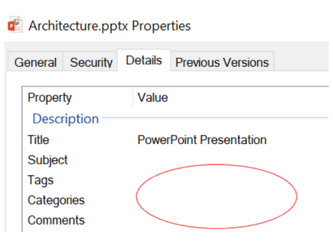
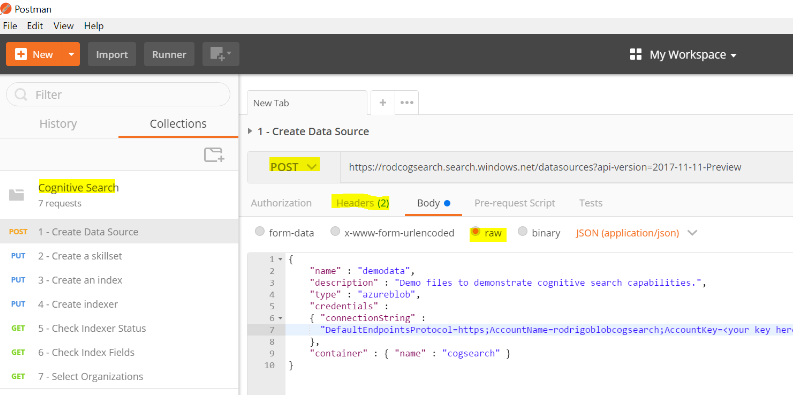

# Solution Architecture

This solution uses a variety of pre-built cognitive skills and extend the AI transformations with custom skills, based on Azure Functions. In this Architecture document you will see details of the solution created throughout the training labs. There are details about the target use case, the dataset, the labs, the cost, the tools, and the interface.

To fully understand this document, It is expected that you have understood all the information presented in the [introduction](./Introduction.md)) of the training: **What is Cognitive Search, How it works, Why it is relevant for any company in the world, when to use it**.

The labs have a progressive level of complexity and they will help you to understand how each aspect of the technology can be used for the search solution.

## Use Case

Every company has business documents: contracts, memos, presentations, images, spreadsheets, business plans and so on. Usually these documents doesn't have the metadata necessary to be searchable, **as you can see in the image below**. Since documents don't have tags, cetegories and comments, they only can be found by name. This creates a poor search experiece, slowing down busiess process and reducing productivity.

Azure Cognitive Search, the Microsoft product for Knowledge Mining, uses the most advanced cognitive capabilities, based on Microsoft's Azure AI Platform, to extract and create enriched metadata about your documents, vastly improving the overall search experience. This process also allow companies to enforce complaince, detect risks and detect policies violations.

Enterprises may need to search for:

+ Words like "risk" and "fraud" in pdf/word contracts, when they are 10 or less words distant one from the other.
+ Specific people or objects in images.
+ Document content instead of its name, the only option for the situation of the image below.
+ Entities like companies or technologies in memos or reports.
+ Compliance violations like forbidden words or phrases in any document or image.
+ Forms content, handwritten or not.

This Cognitive Search solution addresses these problems, extracting insights from multiple documents formats and languages.

>Tip! Some other possible uses for the labs could be:
>
>+ Demos, you can keep this environment ready, loaded
>+ POCs: You just need to upload some of the client's data and re-execute the enrichment pipeline. **You can prove the concept in front of the client, in minutes**.
>+ Production: Since we are using PaaS, it has SLA and scalability by design.
>+ Personal Use: If you have lots of documents or photos, you can use these labs to analyze them, too.

### Architecture

## Labs Details

In the [First Lab](../../labs/lab-environment-creation.md) you will learn how to create the required environment for this training, including the business documents dataset upload into Azure Blob Storage.

In the [Second Lab](../../labs/lab-azure-search.md) you will learn how index the business documents with "basic" Azure Search. The objective is teach how the standard features adds sophisticated search capabilities to your documents: natural language search, ranking, paging, suggestions and so on. This lab will use the Azure Portal only, no coding is required.

In the [Third Lab](../../labs/lab-text-skills.md) you will learn the next level of data enrichment, using Cognitive Search. It will be clear for you how AI can **extend** the metadata created, enabling an advanced search experience. In this lab you will do some coding with Postman.

In the [Fourth Lab](../../labs/lab-image-skills.md) you will learn how text skills don't work for images. You will detect and fix this situation, making your images queryable too. For this lab you will do some coding with Postman.

In the [Fifth Lab](../../labs/lab-custom-skills.md) you will learn how to create a custom skill using Azure Content Moderator API and Azure Functions, connection this transformation into the enrichment pipeline. You will detect documents with incompliant content. For this lab you will do some coding with Postman and Visual Studio. The Azure Portal is also used, to create the Azure Function instance.

In the [Sixth Lab](../../labs/lab-bot-business-documents.md) you will learn how to use a Bot to interact with the Azure Search Index, the Business Documents Bot. This lab uses the Bot Emulator and Visual Studio.

In the [Seventh Lab](../../labs/lab-final-case.md) you are invited to, based on what you have learned, create the architecture of a Knowledge Mining solution for another use case.

## Dataset

We will provide a sample dataset that contains documents with multiple languages and formats including HTML, doc, pdf, ppt, png and jpg. They were selected for a better learning experience, showcasing the technology capabilities.

The dataset has 19 files and 15 MBs. It includes public Microsoft business documents. There is a document in spanish, so you can learn about langauge identification. There is also a document with anonimized Personal Indetifiable Information (PII) for the Content Moderator lab.

Since we are working with unstructured data, any set of files can be used. In other words, this could be a **Bring Your Own Data** solution; you can test later with any dataset you want.

## Demo - Cognitive Search Pipeline

The [AI Sandbox](https://text-analytics-demo-dev.azurewebsites.net/) is an interesting demo of the Cognitive Search Pipeline, similar to what will be implemented. It is useful to understand how a cognitive skill output is input for another one, in the same pipeline.
This demo is public and you can use with clients and partners.

## Costs

Here you can see a list of the resources used in this training. The [Azure Calculator](https://azure.microsoft.com/en-us/pricing/calculator/) can be used for pricing estimation.
Prices are estimates and are not intended as actual price quotes. Actual prices may vary depending upon the date of purchase, currency of payment, and type of agreement you enter with Microsoft. Contact a Microsoft sales representative for additional information on pricing.
**The estimated daily cost of this training, with the provided dataset, is close to US$ 15,00.**  

| Item | Detail | Description
|-------|----------|----------|
| Blob Storage | 20 MB |To store the documents |
| Azure Search | Basic Tier: 16 documents, 1 index | To execute all cognitive processing |
| Azure Functions | Up to 100 executions| To host and execute the custom cognitive service we will create |
| Cognitive Services | Up to 100 executions, 1000 seconds | To execute the custom cognitive service |

## Information Delivery - A Bot as User Interface

Microsoft Azure Search provides an API for web or mobile applications, creating great search experieces for users. Another type of application that can benefit from Azure Search is a Bot, a trending technology from Microsoft.

Although this is not a training on bots, you will learn how to integrate one with the  [Azure Search Rest API](https://docs.microsoft.com/en-us/azure/search/search-query-rest-api). This Bot will be as simple as possible, runninng locally with the [Bot Emulator](https://github.com/Microsoft/BotFramework-Emulator).

This [gif](../../resources/images/sol-arch/retrieving-cognitive-attrributes.gif) has the expected finished solution, but with a different dataset. Now you have idea of what we will be created by the end of the training.

The Microsoft Learn AI Team has a 2 day [Computer Vision Bot Bootcamp](https://azure.github.io/LearnAI-Bootcamp/emergingaidev_bootcamp) that shows you how to create an intelligent bot using Azure Search, CosmosDB and Cognitive Services.

## Lab Tools for APIs

Labs 3, 4, and 5 will use Postman for [REST API calls](https://docs.microsoft.com/en-us/azure/search/search-fiddler). You can use any other REST API tool that can formulate and send HTTP requests, but we suggest you to use Postman since the training was created with/for it. The image below shows a visual example of Postman being used for Cognitive Search. Please check the suggested Postman tutoral on [Pre-Reqs section of the initial page](./readme.md).

> Tip! Important details about Postman:
> + You can save your commands, which is useful for reuse, not only within this workshop, but also in your future projects.
> + You need to create a free account. A confirmation message is emailed to you.
> + You can export all your commands into json format. This file can then be saved into the storage account of the lab, into a cloud storage like OneDrive, or anywhere you like. This process helps you save, share, and reuse your work.
> + These return codes indicate success after an API call request: 200, 201 and 204.
> + Error messages and warnings are very clear.
> + Besides the API URL and call type, we will use GET/PUT/POST (depending on what action we are taking), and you need to use the header for Content-Type and api-key. The json commands must be placed into the "body / raw" area. If you are struggling using Postman, here's a friendly reminder to [review the resource from the prerequisites](https://docs.microsoft.com/en-us/azure/search/search-fiddler).

## Next step

[Environment Creation Lab](../../labs/lab-environment-creation.md) or [Back to Read Me](../../README.md)